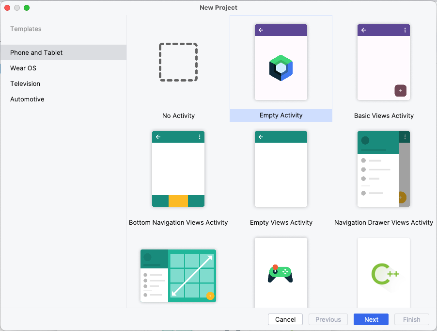
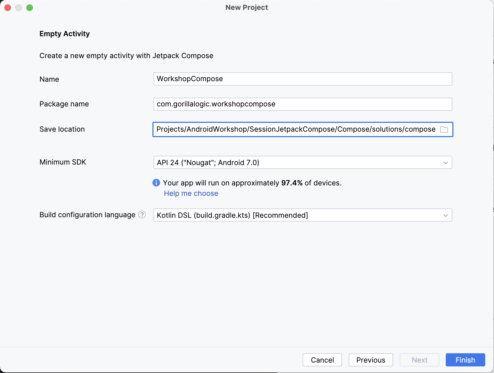
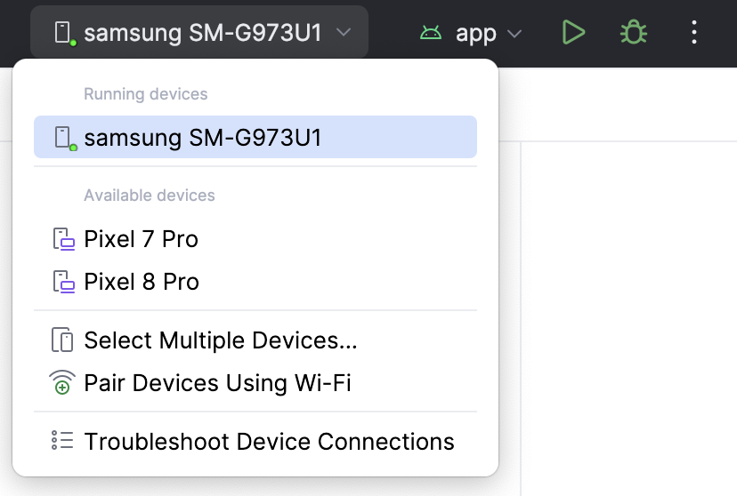

# 2. Environment preparation

As you already downloaded, install and prepare `Android Studio` in the first session of the workshop, we will skip this step here. 

If you need to download and install `Android Studio` from scratch, you can check the first session of this workshop and follow the steps in the second section of it.

## Create new project

To create a new project that use `Jetpack Compose`, follow these steps:

1. Open `Android Studio` and select to create a new project from the main menu. 
Select `Empty Activity` from the `Phone and Tablet` templates and select `Next`
     
     
    
     
1. In the `New project` screen, set the properties to:

    | **Property** | **Value**     |
    | ----------|-----------------|
    | Name     |  WorkshopCompose        |
    | Package     |  com.gorillalogic.workshopcompose        |
    | Save Location     |  Select a folder of your preference        |
    | Language     |  Kotlin        |

    Leave the `Minimum SDK` and the `build configuration` with the default values.
    Select `Finish` and wait until the project is created and configured by `Android Studio`.
     
     
    
     
1. Build and run the project using a real device: 
    Connect the device using USB and select it from the devices dropdown: 
     
     
    
     
    If you don’t see your device in the dropdown, you can check this guide for help: <a href="https://developer.android.com/studio/run/device" target="_blank">Run on a device</a>
    
1. Build and run the project using a virtual device:
    Follow the steps in the section `Create an AVD` from the link below: <a href="https://developer.android.com/studio/run/managing-avds" target="_blank">Managing AVDS</a>

---

| [Previous: Project review](project-review.mdx) | [Next: Create Main Screen](create-main-screen.mdx) |
| :- | :- |
