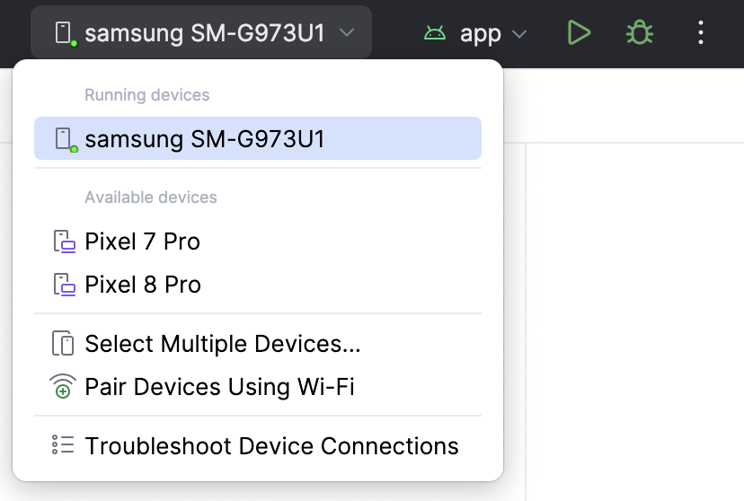

# 1. Project review

## Design and requirements

The requirements for the project are almost the same that we already complete in the first session of the workshop with some cool additions:
1. Create a screen that shows a list of items that represent the Gorilla Logic perks.
1. Each item is represented by an image, a title and a description.
1. The list must be dynamically loaded using mock data.
1. Create a detail screen showing the details of the perk selected from the main screen.
1. The app must navigate to the detail screen when the user selects one of the items in the main screen.
1. The app must come back to the main screen when the back button is pressed in the details screen.
1. The design for will be the default theme, colors and style provided by `Android Studio`
1. `NEW:` Add a `Refresh` button in the home screen to reload the items in the list.
1. `NEW:` Add an `Add` button in the home screen that add a new perk at random to the list.

This is an example of how it should look like once completed:
 

 

---

| [Next: Environment preparation](environment-preparation.mdx) |
| -:|
